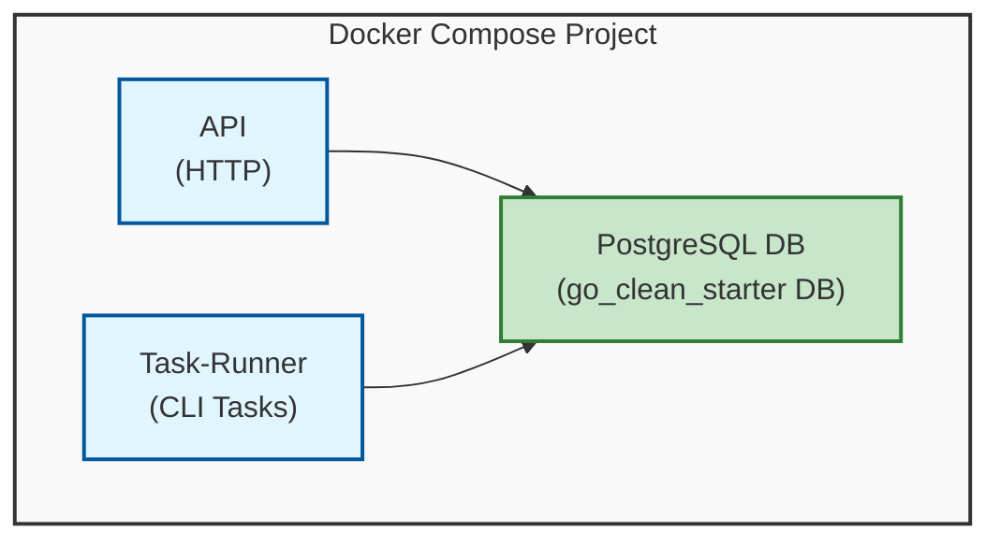

# go-clean-starter
これはクリーンアーキテクチャを採用し、最新のライブラリを活用したGoのテンプレートです。バックエンド開発を効率化し、加速させることを目的としています。

## 必要な環境
| 名前 | 用途 |
|-|-|
| [Go](https://go.dev/) | バックエンドアプリケーション |
| [Docker and docker-compose](https://www.docker.com/) | コンテナ環境 |
| [goimports](https://pkg.go.dev/golang.org/x/tools/cmd/goimports) | ソースコードのフォーマット |
| [golangci-lint](https://github.com/golangci/golangci-lint) | ソースコードの静的解析 |

## 概要
このアプリケーションは3つのコンテナで構成されています。
- `api` APIサーバー
- `task` タスクの実行
- `postgres` データベース

### アーキテクチャ


### 主要技術
- **Go**: 高性能、シンプルさ、強力な並行処理サポートを持つこのアプリの主要言語
- **Echo**: クリーンなルーティングと豊富なミドルウェアサポートを持つ高速で軽量なHTTPウェブフレームワーク
- **PostgreSQL**: JSONB、全文検索、強い一貫性などの高度な機能を持つ信頼性の高いデータベース
- **sqlc**: 生のSQLクエリからタイプセーフなGoコードを生成し、コンパイル時の安全性とより良いパフォーマンスを提供
- **golang-migrate**: バージョン管理、ロック、ロールバックサポートを持つデータベーススキーママイグレーションツール
- **oapi-codegen**: OpenAPI仕様からGoの構造体と型を生成し、タイプセーフなAPI開発を実現
- **手動依存性注入**: プレーンなGoコンストラクタを使用したシンプルで明示的な依存関係管理
- **Air**: ファイル変更時の自動リビルドによる高速な開発サイクルを実現するホットリロードツール
- **Docker & Docker Compose**: 一貫した開発・デプロイ環境のためのコンテナ化技術

### ディレクトリ構成

```bash
go-clean-starter
├── builder
│   ├── builder.go      # 手動依存性注入の初期化
│   └── dependency.go   # 依存関係の解決とセットアップ
├── cmd
│   ├── migration.go    # マイグレーション実行コマンド
│   ├── serve.go        # APIサーバー実行コマンド
│   └── task.go         # タスク実行コマンド（現在は1つのタスクのみ定義）
├── config
├── domain # ドメインモデル
├── go.sum
├── internal
│   ├── http # HTTP層
│   │   ├── base
│   │   ├── handler
│   │   │   ├── errors.go
│   │   │   ├── openapi_types.gen.go #  doc/api.yamlから自動生成されたGoストラクト
│   │   │   └── user
│   │   ├── middleware
│   │   └── server.go
│   ├── repository # データアクセス層
│   │   ├── item
│   │   ├── user
│   │   └── transaction.go
│   ├── service # ビジネスロジック層
│   │   └── user
│   ├── sqlc # sqlcのインプット・アウトプット
│   │   ├── query
│   │   │   ├── items.sql
│   │   │   └── users.sql
│   │   ├── db.go
│   │   ├── items.sql.go
│   │   ├── models.go
│   │   └── users.sql.go
│   └── task # ジョブ、バッチなどのタスクプログラム
│       └── item
│           ├── data
│           │   └── item.csv
│           ├── item.go
│           └── usecase.go
├── main.go
├── migration
│   ├── migrate.go
│   └── sql # マイグレーション用SQLファイル
├── pkg     # 現在pkgは空です。他のプロジェクトからインポート可能なパッケージを追加してください
├── README.md
├── WHY.md  # 技術スタックと技術仕様の選択理由を説明するドキュメント
├── docker-compose.test.yaml
├── docker-compose.yaml
└── sqlc.yaml # sqlcの設定ファイル
```

## クイックスタート

初回セットアップの場合は、以下のコマンドを実行してください：
```bash
make quickstart
```

このコマンドは以下を実行します：
1. `.env.example`から`.env`を作成（存在しない場合）
2. すべてのコンテナをビルドして起動

APIは`http://localhost:8080`で利用可能になります。

💡 このプロジェクトは**[air](https://github.com/air-verse/air)**を使用しており、これはGoのホットリロード機能です。ホットリロードにより、より高速な開発が可能になります。

## テスト
- `make test`を実行してテストを行います
`make test`は、開発環境と同じ[Dockerfile](./Dockerfile)を使用して、テスト専用の[docker-compose.test.yaml](./docker-compose.test.yaml)でテスト環境を作成します。
これにより、開発用のローカル環境から分離されたテスト環境の安全性が保証されます。

```bash
make test
```

## API使用方法

サーバーが起動したら、以下のようにAPIを利用できます：

📋 **完全なAPIドキュメントは[`api.yaml`](./api.yaml)で確認できます** - すべてのエンドポイント、スキーマ、サンプルを含むOpenAPI 3.1仕様書です。

### ヘルスチェック
```bash
curl http://localhost:8080/health
```

### ヘルプの取得
- 既知の問題については[Issues](https://github.com/SoraDaibu/go-clean-starter/issues)を確認してください。
- アーキテクチャの選定理由については[WHY.md](./WHY.md)を参照してください。

## 貢献
このプロジェクトに貢献するには[CONTRIUTING.md](./CONTRIBUTING.md)をお読みください。

---

📖 **English version**: [README.md](./README.md)
