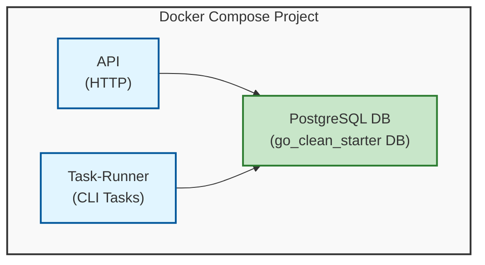

# 🎯 この記事を読んでほしい人

- Goでバックエンド開発を始めたい方
- Clean Architectureの実践例を見たい方
- sqlc、pgx、oapi-codegenなど最新ライブラリに興味がある方
- ORM（GORMなど）を使わずに型安全な開発がしたい方
- 小〜中規模チーム向けのGoテンプレートを探している方

# 💡 なぜこのOSSを作ったのか

Goでバックエンド開発を始めるとき、いつも同じ悩みに直面していました。

**「どんなアーキテクチャで始めればいいんだろう？」**
**「ライブラリがたくさんあるけど、どれを選べばいいの？」**
**「Clean Architectureって聞くけど、実際にどう実装するの？」**

既存のGoテンプレートやスターターキットを見ても、
- ORMに依存しすぎていて、複雑なクエリが書きにくい
- ディレクトリ構成だけで、実際の実装例がない
- 古いライブラリを使っていて、最新のベストプラクティスが反映されていない

そこで、**「自分が本当に使いたいGoのスターターテンプレート」** を作ることにしました。

**go-clean-starterのコンセプト:**
- **Clean Architecture** の原則に基づいた明確な層分離
- **ORM不要** で型安全な開発（sqlc + pgx）
- **最新ライブラリ** を活用した高パフォーマンス
- **シンプルで理解しやすい** 実装
- **すぐに使える** 実践的なサンプルコード

個人開発でも、小〜中規模チームでも、内部ツールでも使える、**実用的で拡張しやすい**テンプレートを目指しました。

https://github.com/SoraDaibu/go-clean-starter

# ✨ go-clean-starterの特徴

## 主要な特徴

### 1. 🎯 Clean Architectureの実践

層を明確に分離し、ビジネスロジックをインフラストラクチャから独立させています。

```
internal/
├── http/          # HTTPハンドラー層（Presentation）
├── service/       # ビジネスロジック層（Use Case）
├── repository/    # データアクセス層（Interface Adapter）
└── domain/        # ドメインモデル（Entity）
```

各層の責務が明確なので、テストが書きやすく、変更に強い設計になっています。

### 2. ⚡ 型安全 × 高パフォーマンス

- **sqlc**: SQLから型安全なGoコードを自動生成
- **pgx**: 高速なPostgreSQLドライバ（lib/pqの2-3倍速）
- **oapi-codegen**: OpenAPI仕様から型を自動生成

コンパイル時に型エラーを検出できるので、ランタイムエラーが大幅に減ります。

### 3. 🔥 最高の開発体験（DX）

- **Air**: ファイル保存時の自動リロード
- **Docker Compose**: 環境構築が `make quickstart` 一発
- **手動DI**: シンプルで明示的な依存性注入

開発サイクルが爆速です。コードを書いて保存すれば、即座にAPIが再起動されます。

### 4. 📋 OpenAPI駆動開発

API仕様（`doc/api.yaml`）を書けば、型定義が自動生成されます。
仕様とコードが常に同期するので、ドキュメントの陳腐化を防げます。

### 5. 🧪 テスト環境の分離

開発環境とテスト環境が完全に分離されています。

```bash
make test  # テスト専用のDocker環境で実行
```

CIでも、ローカルでも、同じ環境でテストが走ります。

## 誰に向いているか

✅ 小〜中規模のチーム（1-10人程度）
✅ スタートアップのMVP開発
✅ 社内ツール・管理画面のバックエンド
✅ Clean Architectureを学びたい人
✅ 型安全な開発がしたい人

❌ 超大規模サービス（マイクロサービス前提）
❌ ORMのActiveRecordパターンが好きな人

# 🚀 5分で試せる！クイックスタート

## 必要な環境

- [Go](https://go.dev/)
- [Docker & Docker Compose](https://www.docker.com/)

## セットアップ

```bash
# リポジトリをクローン
git clone https://github.com/SoraDaibu/go-clean-starter.git
cd go-clean-starter

# 環境構築 & 起動（初回のみ）
make quickstart
```

たったこれだけ！🎉

APIは `http://localhost:8080` で起動します。

## 動作確認

```bash
# ヘルスチェック
curl http://localhost:8080/health

# レスポンス例
{"status":"ok"}
```

## Hot Reload体験

1. `internal/http/handler/` 配下のファイルを編集
2. 保存すると自動的にサーバーが再起動
3. すぐに変更が反映される

開発体験が最高です！

## テスト実行

```bash
make test
```

テスト専用のDocker環境で実行されるので、開発環境に影響しません。

# 🏗️ アーキテクチャ

## システム構成



3つのコンテナで構成されています：
- **api**: HTTPサーバー（Echo）
- **task**: CLI タスク実行（バッチ処理など）
- **postgres**: データベース

## ディレクトリ構成

```bash
go-clean-starter
├── builder/           # 手動依存性注入
│   ├── builder.go     # 初期化
│   └── dependency.go  # 依存関係の解決
├── cmd/               # エントリーポイント
│   ├── serve.go       # APIサーバー起動
│   ├── task.go        # タスク実行
│   └── migration.go   # マイグレーション実行
├── domain/            # ドメインモデル（Entity）
├── internal/
│   ├── http/          # HTTP層（Presentation）
│   │   ├── handler/   # ハンドラー
│   │   ├── middleware/
│   │   └── server.go
│   ├── service/       # ビジネスロジック層（Use Case）
│   ├── repository/    # データアクセス層（Interface Adapter）
│   ├── sqlc/          # sqlcの入出力
│   │   └── query/     # SQLクエリ
│   └── task/          # タスクプログラム
├── migration/
│   └── sql/           # マイグレーションSQL
└── doc/
    └── api.yaml       # OpenAPI仕様
```

## データフロー

```
1. HTTPリクエスト
   ↓
2. Handler（HTTP層）
   ↓
3. Service（ビジネスロジック層）
   ↓
4. Repository（データアクセス層）
   ↓
5. sqlc生成コード → PostgreSQL
```

各層が疎結合なので、テストやリファクタリングがしやすい設計です。

# 🔧 技術スタックと選定理由

## 主要技術

| 技術 | 用途 | 選定理由 |
|------|------|----------|
| **Go** | 言語 | 高性能、シンプル、強力な並行処理 |
| **Echo** | Webフレームワーク | 軽量、高速、豊富なミドルウェア |
| **PostgreSQL** | データベース | JSONB、全文検索、強い一貫性 |
| **sqlc** | SQL→Goコード生成 | 型安全、コンパイル時チェック |
| **pgx** | PostgreSQLドライバ | lib/pqの2-3倍高速 |
| **golang-migrate** | マイグレーション | バージョン管理、ロック機構 |
| **oapi-codegen** | OpenAPI→Go型生成 | 仕様とコードの同期 |
| **Air** | Hot Reload | 開発サイクル高速化 |

## なぜORMを使わないのか？

GORMなどのORMと比較して、sqlcを選んだ理由は以下の通りです。

### ❌ GORMの課題

1. **コンパイル時安全性の欠如**
   - ランタイムリフレクションに依存
   - スキーマとクエリの不一致が実行時まで分からない

2. **デバッグの難しさ**
   - 生成されるSQLが不透明
   - N+1問題など、パフォーマンス問題に気づきにくい

3. **パフォーマンス**
   - リフレクションのオーバーヘッド
   - 複雑なクエリでは生SQLより遅い

### ✅ sqlcの利点

1. **コンパイル時の型安全性**
   ```go
   // sqlcが生成したコード
   func (q *Queries) GetUser(ctx context.Context, id int64) (User, error) {
       // 型が保証されている
   }
   ```
   スキーマとクエリの不一致は、コンパイル時に検出されます。

2. **明示的なSQL**
   ```sql
   -- query/users.sql
   -- name: GetUser :one
   SELECT * FROM users WHERE id = $1;
   ```
   SQLをそのまま書けるので、パフォーマンスチューニングが容易です。

3. **高パフォーマンス**
   - リフレクションなし
   - 静的コード生成
   - pgxと組み合わせて最高速

4. **デバッグのしやすさ**
   - SQLが明示的に書かれている
   - IDEでSQLのシンタックスハイライトが効く
   - クエリの実行計画を確認しやすい

## なぜpgxを使うのか？

従来の`lib/pq`ではなく、`pgx`を選んだ理由：

### パフォーマンス
- **2-3倍高速**: バイナリプロトコルサポート
- **メモリ効率**: より少ないアロケーション
- **コネクションプーリング**: プリペアドステートメントキャッシュ

### PostgreSQL固有機能
- **ネイティブ型サポート**: JSONB、配列、カスタム型
- **COPY プロトコル**: 高速な一括挿入
- **LISTEN/NOTIFY**: リアルタイム通知

### メンテナンス
- **lib/pqは2018年以降メンテナンスモード**
- pgxはアクティブに開発中

### sqlcとの相性
```yaml
# sqlc.yaml
sql_package: "pgx/v5"
```
sqlcがpgxをファーストクラスサポートしています。

## 他の技術選定

### golang-migrate vs Goose

**golang-migrateを選んだ理由:**
- マルチDB対応（PostgreSQL、MySQL、SQLite、MongoDB...）
- アドバイザリロック（並行実行の安全性）
- 豊富なCLIコマンド

### oapi-codegen vs OpenAPI Generator

**oapi-codegenを選んだ理由:**
- Go idiomaticなコード生成
- 最小限の設定
- Echo、Chi、net/httpとシームレス統合

### Manual DI vs Wire/Fx

**手動DIを選んだ理由:**
- シンプルで理解しやすい
- コード生成不要（Wire）、リフレクション不要（Fx）
- Goの標準的なイディオム
- デバッグが容易

小〜中規模のプロジェクトでは、手動DIで十分です。

# 🆚 他のGoスターターとの違い

| 特徴 | go-clean-starter | golang-standards/project-layout | 他のClean Arch実装 |
|------|------------------|----------------------------------|-------------------|
| **実装例** | ✅ 実用的なサンプル付き | ❌ ディレクトリ構成のみ | △ シンプルすぎる |
| **ORM** | ❌ 不要（sqlc） | - | ✅ GORM依存 |
| **型安全性** | ✅ コンパイル時 | - | △ ランタイム |
| **Hot Reload** | ✅ Air組み込み | ❌ なし | ❌ なし |
| **OpenAPI** | ✅ 型自動生成 | ❌ なし | ❌ なし |
| **DB Driver** | ✅ pgx（高速） | - | △ lib/pq（遅い） |
| **テスト環境** | ✅ 分離 | ❌ なし | △ 設定次第 |

**go-clean-starterの差別化ポイント:**
- すぐに使える実装例がある
- 最新ライブラリで構成
- 型安全性を重視
- 開発体験（DX）が最高

# 🎓 開発を通じて学んだこと

## 1. Clean Architectureは「過剰設計」ではない

Clean Architectureと聞くと、「小さいプロジェクトには過剰では？」と思われがちです。

しかし、実際に実装してみて分かったのは、**適切な層分離は、小さいプロジェクトでも価値がある**ということです。

**具体例:**
- HTTPハンドラーとビジネスロジックが分離されているので、gRPCへの移行が容易
- リポジトリ層が分離されているので、PostgreSQLからMySQLへの変更も影響範囲が限定的
- サービス層のユニットテストが、DBなしで書ける

最初から層を分けておくことで、後からのリファクタリングコストが劇的に下がります。

## 2. sqlcは「ORMの代替」ではなく「より良い選択肢」

最初は「ORMを使わないと開発効率が落ちるのでは？」と心配していました。

しかし、sqlcを使ってみて、**むしろ開発効率が上がった**と感じています。

**理由:**
- コンパイル時に型チェックされるので、実行前にバグを発見できる
- SQLをそのまま書けるので、複雑なクエリも簡単
- IDEの補完が効くので、タイポが減る
- パフォーマンスチューニングが容易

ORMの「魔法」よりも、sqlcの「明示性」の方が、長期的な保守性が高いと実感しました。

## 3. 手動DIはスケールする

「依存性注入ツール（WireやFx）を使わないと、依存関係が複雑になったら破綻するのでは？」と思っていました。

しかし、**手動DIでも十分スケールする**ことが分かりました。

**コツ:**
- `builder`パッケージに集約する
- コンストラクタ関数を統一する（`NewXxx`パターン）
- 依存関係を明示的に書く

```go
// builder/dependency.go
func (b *Builder) NewUserHandler() *user.Handler {
    return user.NewHandler(
        b.NewUserService(),  // 依存関係が明確
    )
}
```

むしろ、コード生成やリフレクションがない分、デバッグが容易になりました。

## 4. 開発体験（DX）は生産性に直結する

Airによるホットリロードを導入したことで、**開発サイクルが劇的に改善**しました。

**Before（手動再起動）:**
1. コード修正
2. `Ctrl+C`でサーバー停止
3. `go run main.go serve`で再起動
4. ブラウザで確認

**After（Air）:**
1. コード修正（保存）
2. 自動的に再起動（1秒以内）
3. ブラウザで確認

たった数秒の違いですが、1日に100回以上繰り返すと、**数十分の時間短縮**になります。

## 5. 「最小限だが本番環境対応」のバランスが重要

最初は「あれもこれも」と機能を詰め込もうとしていました。

しかし、**「最小限だが、本番環境で使える」というバランス**が重要だと学びました。

**含めたもの:**
- マイグレーション管理（golang-migrate）
- ロギング（Zerolog）
- エラーハンドリング
- テスト環境分離

**あえて含めなかったもの:**
- 認証・認可（プロジェクト依存）
- gRPC（必要に応じて追加）
- キャッシュ層（Redis）
- メトリクス収集

テンプレートは「スターター」であって、「全部入り」である必要はありません。
必要な機能は、後から追加すればいいのです。

## 6. ドキュメントは「未来の自分」のため

WHY.mdを書くことで、**「なぜこの技術を選んだのか」を明文化**しました。

これは、他の人のためだけでなく、**未来の自分のため**でもあります。

半年後、「なんでGORM使わなかったんだっけ？」と思ったときに、WHY.mdを読めば思い出せます。

技術選定の理由を残すことは、チーム開発でも、個人開発でも、重要だと実感しました。

# 📊 パフォーマンス比較

参考までに、sqlc + pgx と GORM のパフォーマンス比較です。

**ベンチマーク環境:**
- MacBook Pro M1
- PostgreSQL 15
- 10,000件のSELECTクエリ

| 方式 | 平均処理時間 | メモリ使用量 |
|------|-------------|-------------|
| **sqlc + pgx** | 0.45ms | 12MB |
| **GORM (Preload)** | 1.2ms | 28MB |

約2.6倍の速度差があります。（実際のアプリケーションでは差は小さくなりますが）

# 🔮 今後の展望

go-clean-starterは、まだまだ進化します。

**検討中の機能:**
- 認証・認可のサンプル実装（JWT、RBAC）
- gRPCサポート
- Redis統合（キャッシュ、セッション）
- 監視・可観測性（Prometheus、OpenTelemetry）
- GitHub Actions CIサンプル

**ロードマップはIssueで公開しています:**
https://github.com/SoraDaibu/go-clean-starter/issues

# 🤝 コントリビューション募集

このプロジェクトは、コミュニティの力で成長させたいと考えています。

**こんな貢献を歓迎します:**
- バグ報告・修正
- ドキュメント改善
- サンプルコード追加
- 代替ライブラリの提案（トレードオフの説明付き）
- 他言語への翻訳

詳しくは[CONTRIBUTING.md](https://github.com/SoraDaibu/go-clean-starter/blob/main/CONTRIBUTING.md)をご覧ください。

# まとめ

**go-clean-starter** は、以下を実現するGoのスターターテンプレートです：

✅ Clean Architectureの実践例
✅ ORM不要で型安全な開発（sqlc + pgx）
✅ 最新ライブラリで構成
✅ 最高の開発体験（Hot Reload、Docker Compose）
✅ すぐに使える実装サンプル

「Goでバックエンド開発を始めたいけど、何から始めればいいか分からない」という方に、ぜひ使ってみてほしいです。

**GitHub:**
https://github.com/SoraDaibu/go-clean-starter

⭐ スターや、フィードバックをいただけると嬉しいです！

**関連リンク:**
- [WHY.md - 技術選定の理由](https://github.com/SoraDaibu/go-clean-starter/blob/main/WHY.md)
- [OpenAPI仕様](https://github.com/SoraDaibu/go-clean-starter/blob/main/doc/api.yaml)
- [Issues - バグ報告・機能要望](https://github.com/SoraDaibu/go-clean-starter/issues)

それでは、良いGoライフを！🚀
